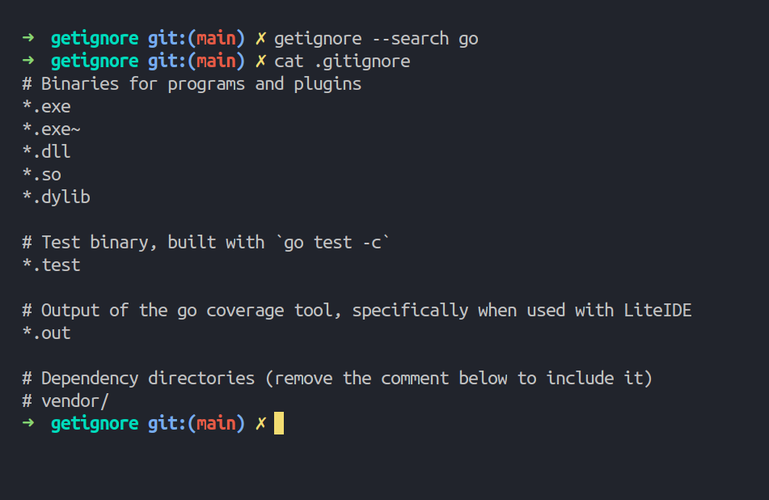

# getignore

`getignore` is a command-line utility to fetch `.gitignore` files from [Github's Gitignore](https://www.github.com/github/gitignore) repository.

Start your new projects right, by including a `.gitignore` file from the very beginning!

## Usage

### Interactive

Run `getignore`, search for a file, and you're done!

### Non-interactive

- Run `getignore --search <query>`. 
- `getignore` will automatically pick the best matching search result and append its contents to your `.gitignore` file

## Installation

You can find pre-compiled binaries for popular platforms on the [Releases](https://github.com/haroldadmin/getignore/releases) page.

### Building from source

- Install the [Go programming language](https://golang.org/)
- Run `go get github.com/haroldadmin/getignore`

### Automated Release Publication
There are open issues for making `getignore` available as [pre-compiled binaries](https://github.com/haroldadmin/getignore/issues/3) and also with [various](https://github.com/haroldadmin/getignore/issues/1) [package managers](https://github.com/haroldadmin/getignore/issues/2) automatically on every release.

## Contributions

`getignore` is a very small side-project, and I would continue to maintain it in my free time. If you would like to lend a hand by adding new features or fix bugs, feel free to open issues or pull requests.

## License

See [License](./LICENSE).